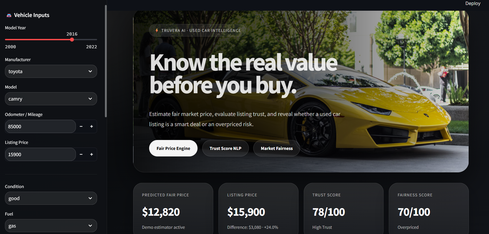
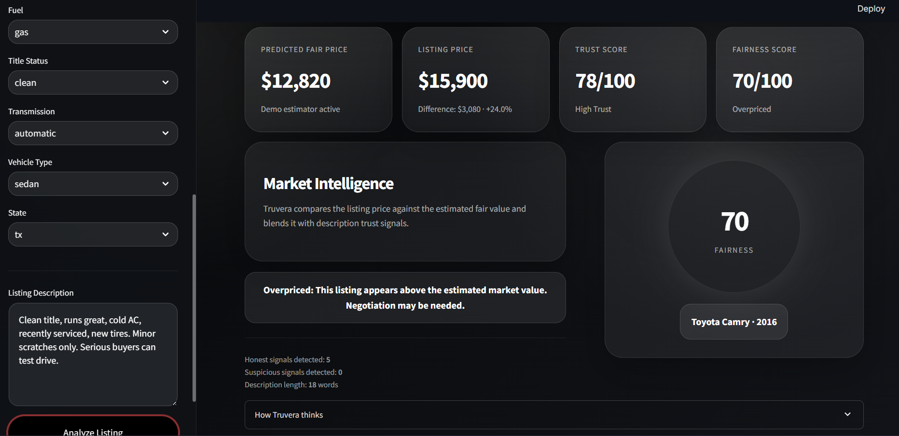

# Truvera

Truvera is an AI-powered used car analysis platform built to help buyers make faster and smarter decisions. Instead of looking only at the seller's asking price, it combines market value estimation with listing-description trust signals to show whether a vehicle looks fairly priced, overpriced, or potentially worth a closer look.

The project is presented through a premium Streamlit interface designed to feel like a polished product demo rather than a notebook output. A buyer can enter core vehicle details, paste a listing description, and get an instant interpretation of price, trust, and market fairness in one place.

## What Truvera does

- Estimates a fair market price for a used vehicle
- Evaluates listing-description trust signals with lightweight NLP logic
- Compares the asking price against the predicted fair value
- Produces a fairness score and a plain-English verdict
- Presents the results in a clean, product-style dashboard

## Why this project matters

Buying a used car often means dealing with incomplete information. Prices can be inflated, descriptions can sound convincing without saying much, and buyers may not know how to judge whether a listing is actually reasonable. Truvera was built to reduce that uncertainty.

It does not try to replace a full inspection or a professional appraisal. Instead, it acts as a decision-support layer that helps users quickly separate promising listings from risky ones.

## Product overview

Truvera brings together three simple ideas:

1. A pricing engine that estimates what a car should be worth based on the available inputs
2. A trust-scoring layer that looks for honest and suspicious wording patterns in the listing text
3. A fairness layer that blends price gap and trust score into a final buyer-friendly interpretation

This makes the output easier to understand than a raw model prediction alone.

## Screens

The interface is designed around a premium dark dashboard layout with a guided input flow on the left and decision-ready outputs on the right.

### Main dashboard

This screen gives the user a complete first-pass view: vehicle inputs, price prediction, trust score, and fairness summary.



### Analysis and verdict panel

This part highlights the market intelligence layer, fairness gauge, and the final verdict a buyer can act on.



## Core inputs

The app accepts practical listing information such as:

- Model year
- Manufacturer and model
- Odometer / mileage
- Listing price
- Condition
- Fuel type
- Title status
- Transmission
- Vehicle type
- State
- Listing description

These fields are enough to create a strong product demo while keeping the experience simple.

## How the scoring works

### Fair price prediction

Truvera uses a trained XGBoost regression model when artifacts are available. If the trained pipeline cannot be loaded, the app falls back to a deterministic demo estimator so the product experience still works end to end.

### Trust score

The listing description is scanned for signals that usually increase buyer confidence, such as maintenance-related wording or transparent ownership clues. It also checks for sales-language patterns that may reduce confidence, such as financing-heavy or pushy promotional phrasing.

### Fairness score

The final fairness score combines:

- The gap between predicted fair price and asking price
- The trust score from the listing text

The output is translated into a simple verdict such as:

- Potential Deal
- Fairly Priced
- Overpriced

## Tech stack

- Python
- Streamlit
- Pandas
- NumPy
- scikit-learn
- XGBoost
- Joblib / Pickle artifacts

## Repository structure

```text
.
|-- artifacts/
|   |-- xgb_price_model.joblib
|   |-- feature_cols.joblib
|   |-- label_encoders.joblib
|   |-- tfidf_vectorizer.joblib
|   |-- ui_options.joblib
|   `-- metadata.json
|-- second-hand-car-price-prediction-and-trust-score.ipynb
|-- truvera_streamlit_app.py
`-- requirements_truvera.txt
```

## Getting started

### 1. Clone the repository

```bash
git clone https://github.com/ezgiorman/TRUVERA-ai-used-car-platform.git
cd TRUVERA-ai-used-car-platform
```

### 2. Install dependencies

```bash
pip install -r requirements_truvera.txt
```

### 3. Run the app

```bash
streamlit run truvera_streamlit_app.py
```

Once the app opens in the browser, enter a vehicle listing and click the analysis button to see the pricing and trust results.

## Model and artifacts

The repository includes serialized artifacts used by the app interface and prediction flow. According to the project metadata:

- Model type: `XGBRegressor`
- Source rows used in export pipeline: `336,818`
- Engineered features: `95`
- Text features: `80` TF-IDF features

This keeps the app practical to demo without requiring users to retrain the model before first use.

## Example use case

Imagine a buyer finds a 2016 Toyota Camry listed for $15,900 with 85,000 miles and a short seller description. Truvera can estimate a fair price, score how trustworthy the description sounds, and explain whether the asking price looks reasonable relative to the market.

That turns a vague listing into a clearer buying signal.

## Future improvements

- Stronger NLP for richer listing-description analysis
- Better model explainability for price predictions
- Support for image-based vehicle inspection signals
- Live listing ingestion from marketplace sources
- Historical pricing trends by model and region

## Author

Built by Ezgi Orman as an applied AI project focused on used car pricing intelligence, trust analysis, and decision support.

